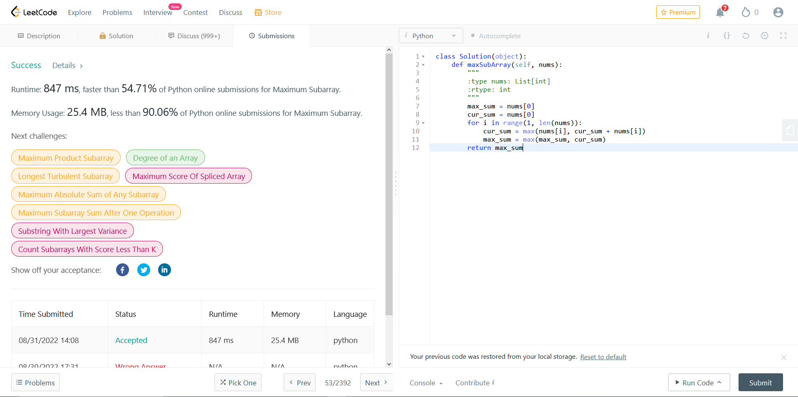

# Write Up

- Very similiar to `Largest Sum` algorithm from course report.

## General Info:

- Question can be found on LeetCode (url: https://leetcode.com/problems/maximum-subarray/).

- Some screenshots can be seen in `./imgs/`.

## Results:

- Question asks to find the maximum sum of a contigous subarray of some input array (which they call `nums`).

    - Array `nums` is an array of integers.

- Leetcode provides the following constraints:
    - 1 <= nums.Length <= 10^5
    - -10^4 <= nums[i] <= 10^4

- Combining the constraints provided by LeetCode and the objective of the question we can construct the following FOL to express the solutions formal specifications:

    - requires 1 <= nums.Length <= 1000000
    - requires forall i :: 0 <= i < nums.Length ==> -100000 <= nums[i] <= 100000
    - ensures max_sum_subarray(nums, sum, 0, nums.Length)

- Where `max_sum_subarray` is a predicate that takes four inputs.
    - The predicates inputs consist of an array of integers called `arr`, and 3 integers called `sum`, `start`, and `stop`.
    - The predicate will return true if input `sum` is the largest sum of a subarray existing between indices `start` and `stop` of array `arr`.

- The function was generated using the following code signature:
  ```
  class Solution(object):
    def maxSubArray(self, nums):
        """
        :type nums: List[int]
        :rtype: int
        """
  ```

- This resulted in copilot generating the following:
    ```
    class Solution(object):
    def maxSubArray(self, nums):
        """
        :type nums: List[int]
        :rtype: int
        """
        max_sum = nums[0]
        cur_sum = nums[0]
        for i in range(1, len(nums)):
            cur_sum = max(nums[i], cur_sum + nums[i])
            max_sum = max(max_sum, cur_sum)
        return max_sum
    ```

- Next the suggested solutions was provided to LeetCode. This resulted in the following:



- Leetcode agreed that the proposed solution was correct.
    - Not extactly the most efficient solution.

- Next we decide to verify this solution using dafny.

- First translated the program from python to dafny (covert for-loops to while-loops, define a `max` function for danfy, define predicates, etc.)

- Next, reasoned about the program to provide invariants for the while loop.

- At this point the program was then sucessfully verified.

- As a result copilot generated a solution to the selected Leetcode problem, which passed all of the leetcode test cases, and was sucessfully verfied using dafny.